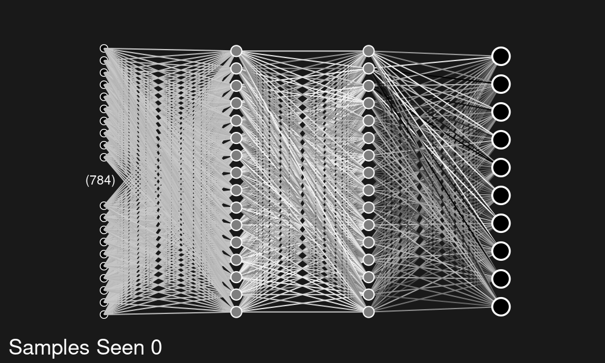

# Tensorflow Network Visualiser

### By codedcosmos
Visualises tensorflow dense and convolutional networks

Supports:

* Dense, Flatten, Conv2D, Input Layers
* Very large Layers (relative to the rest of the network)
* Any size/resolution image export
* Gifs
* GPLv3

And it's highly customisable

## Example Image
